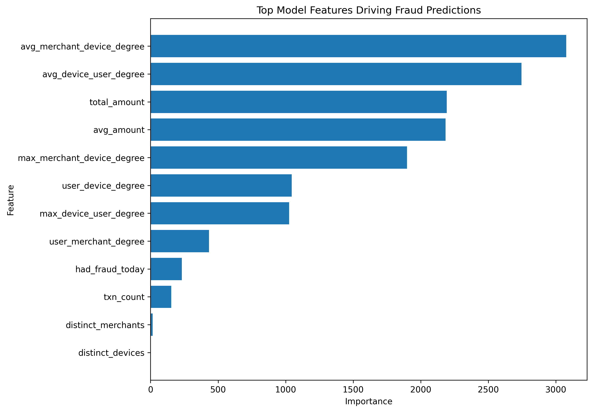

# Real-Time Graph-Based Fraud Detection
This project aims to replicate a production-style fraud detection platform by simulating e-commerce transactions and processing them through a streaming-style ML system.
The platform demonstrates how fraud detection models operate in a realistic production environment by combining event-driven ingestion, offline and online feature storage, model serving, monitoring, and automated retraining.
This project focuses on overall system design for Machine Learning, and not just model training.

## System Overview
The system simulates transaction activity and processes events through a fraud detection pipeline.
Key capabilities demonstrated:
- Kafka event ingestion
- PostgreSQL for an offline data warehouse
- Redis for the online feature store
- Graph-derived behavioral features
- LightGBM for fraud classification
- FastAPI for real-time inference service
- Champion/Challenger model evaluation
- Dataset validation and monitoring
- Automated retraining workflow

## Example Fraud Network

Transactions can be represented as a graph connecting users, devices, and merchants.

Fraud rings often appear as clusters where multiple accounts share devices or merchants.


## Feature Importance

The fraud model combines behavioral and graph-derived features. The chart below shows which signals contribute most to the model’s fraud predictions by showing how many times a feature was used to make decisions.



## Architecture
```
Event Generator
      ↓
    Kafka
      ↓
Kafka Consumer
      ↓
PostgreSQL
      ↓
Feature Builder
      ↓
Redis Feature Store
      ↓
Inference API
      ↓
Monitoring / Retraining
```

## Data Pipeline Flow
```
Synthetic Transactions
        ↓
Kafka Topic (transactions.raw)
        ↓
Consumer Batch Inserts
        ↓
raw_transactions table
        ↓
Feature Engineering
        ↓
Feature Tables
        ↓
Redis Online Features
```

## Tech Stack
### Data Engineering:
- Kafka
- PostgreSQL
- Redis
- Python
- Docker Compose

### Machine Learning:
- LightGBM
- Graph-derived feature engineering
- Fraud classification
- Model Operations:
- FastAPI inference service
- Champion/Challenger evaluation
- Automated retraining pipeline

### Monitoring:
- Dataset validation checks
- Observability via logs and metrics

## Repository Structure:
```
Real-Time-Graph-Based-Fraud-Detection
│
├── compose.yaml
│
├── common_fraud/
|   ├── __init___.py
|   └── training/
|       ├── __init___.py
│       └── lgbm_nextday_trainer.py
|
├── data/
│   ├── transactions.parquet
│   └── metadata.json
|
├── docs/
│   └── fraud_graph_example.png
│
├── event-generator/
|   ├── Dockerfile
|   ├── requirements.txt
│   └── generator.py
│
├── feature-builder/
|   ├── Dockerfile
│   └── build_features.sql
│
├── feature-publisher/
|   ├── Dockerfile
|   ├── requirements.txt
│   └── publish_latest_to_redis.py
|
├── feature-store/
│   └── schema.sql
│
├── inference-api/
|   ├── Dockerfile
|   ├── requirements.txt
│   └── main.py
|
├── ingestion/
|   ├── Dockerfile
|   ├── requirements.txt
│   └── load_to_postgres.py
|
├── kafka-ingest-consumer/
|   ├── Dockerfile
|   ├── requirements.txt
│   └── main.py
│
├── loadtest/
│   └── load_test.py
|
├── model-training/
│   ├── train_lgbm.py
|   ├── Dockerfile
|   ├── requirements.txt
│   ├── artifacts/
|   |   ├── baseline_hist.json
|   |   ├── feature_list.json
|   |   ├── metrics.json
|   |   └── model.joblib
|   |
│   ├── artifacts_challenger/
|   |   ├── baseline_hist.json
|   |   ├── feature_list.json
|   |   ├── metrics.json
|   |   └── model.joblib
|   |
|   └── runs/
|       └── lgbm_nextday_DATETIME
|
├── monitoring/
|   ├── Dockerfile
|   ├── drift_detector.py
│   ├── validate_dataset.py
│   ├── grafana/
|   |   ├── dashboards/
|   |   |    └── fraud-mlops-dashboard.json
|   |   |
|   |   └── provisioning/
|   |       ├── dashboards/
|   |       |    └── fraud-mlops-dashboard.json
|   |       |
|   |       └── datasources/
|   |           └── datasource.yml
|   |
│   └── prometheus/
|       ├── prometheus.yml
|       └── data/
|           ├── queries.active
|           ├── chunks_head/
|           |
|           └── wal/
|               └── 00000000
|           
|
├── notebooks/
|    ├── requirements.txt
|    ├── fraud_graph_visualization.py
|    └── synthetic_data_generator.py
|
├── prediction-monitor/
|    └── prediction_monitor.py
|
└── retain-controller
    ├── retrain_controller.py
    ├── Dockerfile
    └── requirements.txt
```

## Quick Start
### Start infrastructure:
```
docker compose up -d postgres redis kafka
```

### Start the Kafka consumer:
```
docker compose up kafka-ingest-consumer
```

### Generate synthetic transaction events:
```
docker compose up event-generator
```

### Verify data ingestion:
```
docker exec -it fraud-postgres psql -U fraud -d fraud -c "SELECT COUNT(*) FROM raw_transactions;"
```

### Train the model:
```
docker compose up model-training
```

### Publish features to Redis:
```
docker compose up publish-latest-features
```

### Start the inference API:
```
docker compose up -d inference-api
```

### Example API Request:
```
POST /score
```

### Example request body:
```
{
  "user_id": "u_123",
  "amount": 45.20,
  "country": "US"
}
```
The API returns a fraud probability and model metadata.

## Current Limitations
This project focuses on demonstrating the architecture of a fraud detection platform.
Some components are simplified:
- Feature computation is batch-based rather than fully streaming
- Graph features are aggregate metrics rather than learned embeddings
- Model registry integration is not yet implemented
- Synthetic data is used instead of real financial data

## Future Improvements
Planned extensions:
- Node2Vec graph embeddings for fraud rings
- MLflow model registry integration
- Streaming feature computation
- Drift monitoring dashboards
- Online model evaluation

## Why This Project Matters
While most ML portfolio projects only show model training in notebooks, this project demonstrates the full lifecycle of a production ML system:

data ingestion → feature engineering → model training → inference → monitoring → retraining

Through this project, I aim to showcase system design skills critical to Data Science, Machine Learning Engineering, and Data Engineering roles and to test my proficiency in each.

