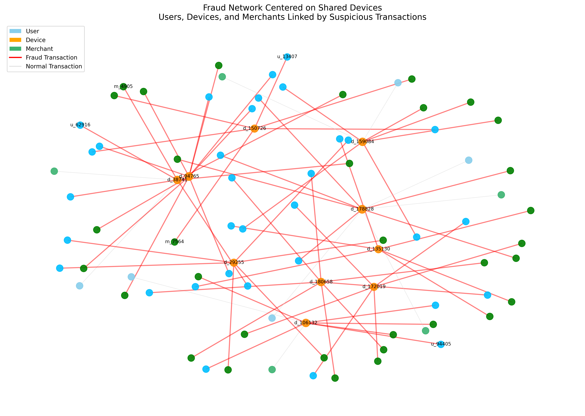
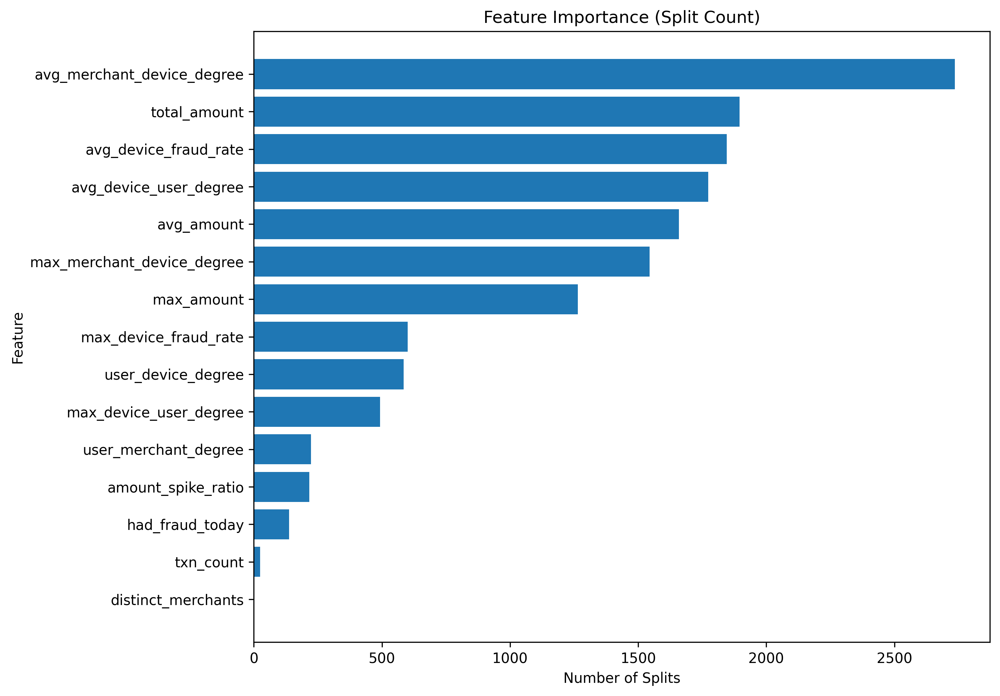
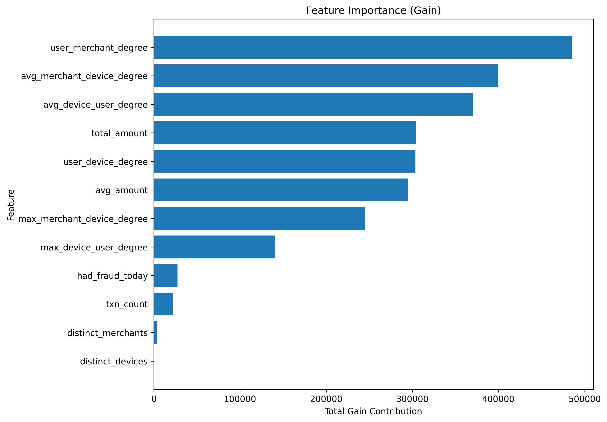
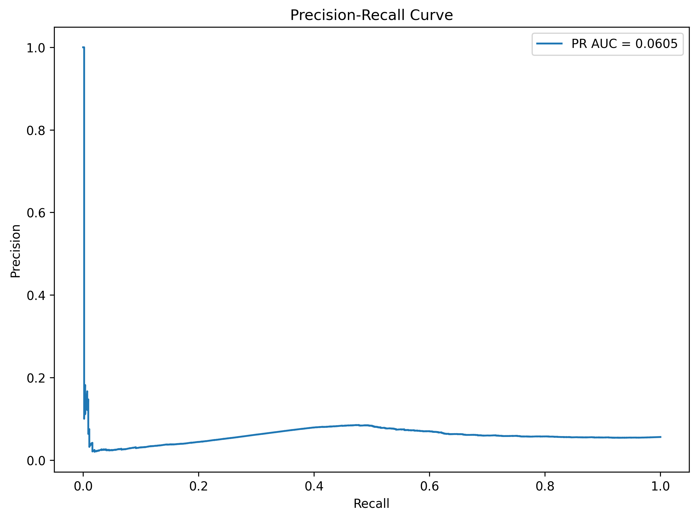

# Real-Time Graph-Based Fraud Detection

A production-style fraud detection platform that simulates e-commerce transactions and processes them through a streaming-inspired machine learning system. This project is designed to demonstrate practical skills across Data Engineering, Machine Learning, and Data Science by combining event-driven ingestion, graph-based feature engineering, model serving, monitoring, and automated retraining.

The system showcases how fraud detection can be implemented in a realistic ML platform setting using:

- **Kafka** for event streaming
- **PostgreSQL** for offline storage and model registry metadata
- **Redis** for online feature serving
- **LightGBM** for fraud scoring
- **FastAPI** for real-time inference
- **Prometheus + Grafana** for observability
- **Champion/Challenger retraining workflows** for model lifecycle management

## What This Project Demonstrates

This repository demonstrates an end-to-end machine learning system for fraud detection, including:

- Event streaming with Kafka
- Streaming-style ingestion into PostgreSQL
- Graph-based fraud feature engineering
- Online feature serving with Redis
- Offline feature storage for training
- LightGBM fraud classification
- Precision–recall model evaluation for extreme class imbalance
- Feature importance visualization (split + gain)
- Prediction and drift monitoring
- Automated retraining workflows with challenger artifacts
- Production-style containerized orchestration with Docker Compose

## Why This Project Matters

This project demonstrates the full lifecycle of a production-style ML system:

**data ingestion → feature engineering → model training → online feature serving → inference → monitoring → retraining**

It is intentionally designed to reflect the kinds of tradeoffs and system boundaries encountered in real fraud detection and MLOps environments.

## Example Fraud Scenario

Transactions can be represented as a graph connecting **users**, **devices**, and **merchants**.

Fraud rings often appear as clusters where multiple accounts share devices or merchants.

Example pattern:

- User A → Device X → Merchant Y  
- User B → Device X → Merchant Y  
- User C → Device X → Merchant Y  

Even if each user appears normal individually, the graph structure can reveal coordinated activity.

Graph features such as the following allow the model to detect these patterns:

- `max_device_user_degree`
- `avg_merchant_device_degree`

The visualization below shows how users, devices, and merchants connect in a fraud cluster:



## Results Snapshot

Example baseline LightGBM performance from a representative run:

- **ROC AUC:** ~0.61
- **PR AUC:** ~0.0054
- **Precision @ 0.5:** ~0.0058
- **Recall @ 0.5:** ~0.154
- **Best F1 threshold:** ~0.30
- **Threshold achieving ~95% recall:** ~0.003

Because fraud is a highly imbalanced classification problem, precision–recall metrics and threshold policies are emphasized over accuracy.

> Note: exact values will vary slightly depending on generated synthetic data and retraining runs.

## Feature Engineering

Fraud detection benefits heavily from both behavioral and graph-derived features.

### Behavioral Features

The system computes user-level daily aggregates such as:

- `txn_count`
- `total_amount`
- `avg_amount`
- `distinct_merchants`
- `distinct_devices`

These features capture unusual spending behavior, changes in velocity, and shifts in account activity.

### Graph Features

Fraud often involves **shared infrastructure** across accounts. To capture this, the project builds graph-derived features from relationships between:

- Users
- Devices
- Merchants

Example edge types:

- `user ↔ device`
- `user ↔ merchant`
- `device ↔ merchant`

Derived features include:

- `user_device_degree`
- `user_merchant_degree`
- `avg_device_user_degree`
- `max_device_user_degree`
- `avg_merchant_device_degree`
- `max_merchant_device_degree`

These features help identify shared devices, suspicious merchant concentrations, and coordinated fraud-ring behavior.

### Experimental / Extended Features

The feature table also supports additional engineered features for future model iterations, such as:

- `max_amount`
- `amount_spike_ratio`
- `avg_device_fraud_rate`
- `max_device_fraud_rate`

These are currently included in the feature-building pipeline but may not yet be enabled in the baseline model configuration.

## Label Definition

The baseline model is trained to predict whether a user will have at least one fraudulent transaction on the following day.

- **Features:** user-level daily aggregates for day **D**
- **Label:** whether the same user has fraud on day **D + 1**

This framing is more realistic than same-row classification and better reflects proactive fraud risk scoring.

> Note: the feature `had_fraud_today` is intentionally included as an experimental feature because recent fraud activity can be highly predictive in fraud operations. In a strict real-time deployment, this feature would require careful temporal auditing or replacement with a leakage-safe equivalent.

## Model Evaluation

### Feature Importance

The fraud detection model uses both behavioral and graph-derived features.

#### Split Importance
Shows how frequently a feature was used in decision-making.



#### Gain Importance
Shows how much predictive power each feature contributed.



### Precision–Recall Curve

The precision–recall curve below is generated on the engineered daily feature table to visualize score separation under class imbalance.

Because fraud detection is a highly imbalanced classification problem, precision–recall is emphasized over accuracy and is often more useful than ROC alone when evaluating operational usefulness.



## Runtime Modes

This project intentionally combines both **streaming-style** and **batch** components:

- **Streaming-style ingestion:** Kafka → `kafka-ingest-consumer` → `raw_transactions`
- **Batch feature computation:** SQL-based daily feature generation and graph aggregates
- **Online serving:** Redis-backed features + FastAPI scoring
- **Batch retraining:** scheduled / controller-driven challenger model generation

This hybrid design reflects how many real production systems evolve before moving to fully streaming feature computation.

## Architecture

```
        +-----------------------+
        | Synthetic Transactions |
        |  Event Generator      |
        +-----------+-----------+
                    |
                    v
               +---------+
               |  Kafka  |
               | Event   |
               | Stream  |
               +----+----+
                    |
                    v
        +--------------------------+
        | kafka-ingest-consumer    |
        | Parse + batch insert     |
        +------------+-------------+
                     |
                     v
            +------------------+
            | PostgreSQL       |
            | raw_transactions |
            +------------------+
                     |
                     v
            +------------------+
            | feature-builder  |
            | Graph Features   |
            +------------------+
                     |
          +----------+-----------+
          v                      v
+----------------+      +------------------+
| Redis          |      | PostgreSQL       |
| Online Feature |      | features table   |
| Store          |      | (training data)  |
+-------+--------+      +---------+--------+
        |                         |
        v                         v
 +--------------+         +----------------+
 | FastAPI      |         | model-training |
 | inference    |         | LightGBM       |
 +------+-------+         +--------+-------+
        |                           |
        v                           v
 +--------------+         +----------------+
 | monitoring   |         | retrain        |
 | prediction   |         | controller     |
 +--------------+         +----------------+
```

## Data Pipeline Flow
```
Synthetic Transactions
        ↓
Kafka Topic (transactions.raw)
        ↓
kafka-ingest-consumer
        ↓
raw_transactions table
        ↓
feature-builder
        ↓
features_user_daily + graph edge tables
        ↓
Redis Online Features
        ↓
FastAPI /score inference
        ↓
Monitoring + Retraining
```

## Tech Stack
### Data Engineering

- Kafka
- PostgreSQL
- Redis
- Python
- SQL
- Docker Compose

### Machine Learning
- LightGBM
- Scikit-learn
- Pandas / NumPy

### Serving / APIs
- FastAPI
- Uvicorn

### Monitoring/MLOps
- Prometheus
- Grafana
- Champion/Challenger model artifacts
- Drift detection
- Prediction monitoring

## Machine Learning
LightGBM is used for fraud classification using behavioral and graph-derived features.

Key model characteristics:
- Handles extreme class imbalance using `scale_pos_weight`
- Optimized for recall to reduce missed fraud
- Evaluated using threshold policies, not just the default 0.5 classification
- Uses both the split and gain feature importance
- Stores drift baseline histograms for downstream monitoring

## Model Operations
The platform includes automated model lifecycle management:
- Champion/Challenger model evaluation
- Challenger artifact generation
- Drift detection using baseline feature histograms
- Prediction score monitoring
- Automatic retraining triggers
- Model registry metadata stored in PostgreSQL
- Model pointer routing for inference

## Repository Structure:
```
Real-Time-Graph-Based-Fraud-Detection
│
├── README.md
├── compose.yaml
│
├── common_fraud/
│   ├── __init__.py
│   └── training/
│       ├── __init__.py
│       └── lgbm_nextday_trainer.py
│
├── data/
│   ├── transactions.parquet
│   └── metadata.json
│
├── docs/
│   ├── fraud_graph_example.png
│   ├── feature_importance_split.png
│   ├── feature_importance_gain.png
│   └── precision_recall_curve.png
│
├── event-generator/
│   ├── Dockerfile
│   ├── requirements.txt
│   └── generator.py
│
├── feature-builder/
│   ├── Dockerfile
│   └── build_features.sql
│
├── feature-publisher/
│   ├── Dockerfile
│   ├── requirements.txt
│   └── publish_latest_to_redis.py
│
├── feature-store/
│   └── schema.sql
│
├── inference-api/
│   ├── Dockerfile
│   ├── requirements.txt
│   └── main.py
│
├── ingestion/
│   ├── Dockerfile
│   ├── requirements.txt
│   └── load_to_postgres.py
│
├── kafka-ingest-consumer/
│   ├── Dockerfile
│   ├── requirements.txt
│   └── main.py
│
├── loadtest/
│   └── load_test.py
│
├── model-training/
│   ├── Dockerfile
│   ├── requirements.txt
│   ├── train_lgbm.py
│   ├── artifacts/
│   │   ├── baseline_hist.json
│   │   ├── feature_list.json
│   │   ├── metrics.json
│   │   └── model.joblib
│   ├── artifacts_challenger/
│   │   ├── baseline_hist.json
│   │   ├── feature_list.json
│   │   ├── metrics.json
│   │   └── model.joblib
│   └── runs/
│       └── lgbm_nextday_DATETIME
│
├── monitoring/
│   ├── Dockerfile
│   ├── drift_detector.py
│   ├── validate_dataset.py
│   ├── grafana/
│   │   ├── dashboards/
│   │   │   └── fraud-mlops-dashboard.json
│   │   └── provisioning/
│   │       ├── dashboards/
│   │       │   └── fraud-mlops-dashboard.json
│   │       └── datasources/
│   │           └── datasource.yml
│   └── prometheus/
│       └── prometheus.yml
│
├── notebooks/
│   ├── requirements.txt
│   ├── synthetic_data_generator.py
│   ├── fraud_graph_visualization.py
│   ├── feature_importance_visualization.py
│   └── precision_recall_visualization.py
│
├── prediction-monitor/
│   └── prediction_monitor.py
│
└── retrain-controller/
    ├── Dockerfile
    ├── requirements.txt
    └── retrain_controller.py
```

## Quick Start
### 1) Start infrastructure
```
docker compose up -d postgres redis kafka
```
### 2) Start the Kafka consumer
```
docker compose up -d kafka-ingest-consumer
```
### 3) Generate synthetic transaction events
```
docker compose up event-generator
```
### 4) Verify ingestion
```
docker exec -it fraud-postgres psql -U fraud -d fraud -c "SELECT COUNT(*) FROM raw_transactions;"
```
You should see a non-zero row count (typically around 1,000,000 for the default configuration).
### 5) Build daily + graph features
```
docker compose up feature-builder
```
This step creates / refreshes:
- `features_user_daily`
- `user_device_edges`
- `user_merchant_edges`
- `device_merchant_edges`
> Note: the current feature-building implementation is a full-batch rebuild for clarity and reproducibility, rather than an incremental streaming aggregation job.
### Train the baseline model
```
docker compose up model-training
```
This writes baseline artifacts to:
- `model-training/artifacts/model.joblib`
- `model-training/artifacts/metrics.json`
- `model-training/artifacts/feature_list.json`
- `model-training/artifacts/baseline_hist.json`
### 7) Publish latest features to Redis
```
docker compose up publish-latest-features
```
### 8) Start the inference API
```
docker compose up -d inference-api
```
### 9) (Optional) Start monitoring stack
```
docker compose up -d drift-detector prometheus grafana prediction-monitor
```
### 10) (Optional) Start retraining the controller
```
docker compose up -d retrain-controller
```
## Example API Request
### Endpoint
```
POST /score
```
### Example request body
```
{
  "user_id": "u_123",
  "amount": 45.20,
  "country": "US"
}
```
The API returns:
- fraud probability
- model version metadata
- model routing information (depending on configuration)
> Depending on deployment mode, the inference service may also support health and metrics endpoints for operational monitoring.

## Reproducing Visualizations
After feature generation and model training, the visualization scripts can be run locally from the repo root.
```
python notebooks/fraud_graph_visualization.py
python notebooks/feature_importance_visualization.py
python notebooks/precision_recall_visualization.py
```
Generated outputs:
- `docs/fraud_graph_example.png`
- `docs/feature_importance_split.png`
- `docs/feature_importance_gain.png`
- `docs/precision_recall_curve.png`

## Current Limitations
This project is intentionally designed as a production-style demonstration, but several components are simplified relative to a fully hardened deployment:
- The synthetic data generator produces realistic but simulated fraud patterns rather than true production behavior.
- Feature engineering is currently batch-oriented at the daily user level, rather than fully streaming per-event feature aggregation.
- The precision–recall visualization is generated from the engineered feature table for interpretability, not as a formal held-out benchmark artifact.
- PostgreSQL is used as a lightweight model registry for simplicity instead of a dedicated registry service such as MLflow.
- Some extended engineered features are present in the feature table but not yet enabled in the baseline LightGBM configuration.

## Production Risks to Address
This project intentionally highlights several real-world production concerns:
- **Data leakage controls:** Features such as same-day fraud indicators can be useful for experimentation, but must be carefully audited to avoid leakage in true real-time scoring.
- **Feature freshness:** Online Redis features and offline PostgreSQL features should be validated for consistency and staleness.
- **Schema evolution:** Kafka message contracts should be versioned to prevent breaking downstream consumers.
- **Backfill/replay safety:** Ingestion should support idempotent reprocessing and safe offset management.
- **Model degradation:** Prediction drift and feature distribution drift should be continuously monitored and tied to retraining policies.
- **Class imbalance:** Fraud prevalence is extremely low, so threshold tuning and alert-volume controls are critical for operational usefulness.
- **Graph feature explosion:** High-cardinality user/device/merchant relationships can grow rapidly and may require pruning, windowing, or approximate graph statistics at a larger scale.

## Scaling Path to Production
If extended into a larger-scale deployment, I would evolve this system by:
* Replacing batch feature generation with Kafka Streams, Spark Structured Streaming, or Apache Flink
- Adding Avro/Protobuf + Schema Registry for Kafka contracts
- Introducing online/offline feature parity tests
- Moving model registry responsibilities to MLflow or a dedicated metadata service
- Implementing cost-sensitive threshold optimization based on fraud loss assumptions and analyst capacity
- Adding incremental graph feature maintenance or approximate graph statistics for high-scale operation

## Future Improvements
Planned or potential extensions include:
- Node2Vec or graph embedding features for fraud ring detection
- MLflow model registry integration
- Streaming feature computation
- Stronger online model evaluation
- More realistic synthetic fraud scenarios
- Cost-based decision policies for fraud review queues
- More sophisticated drift alerting and dashboarding
